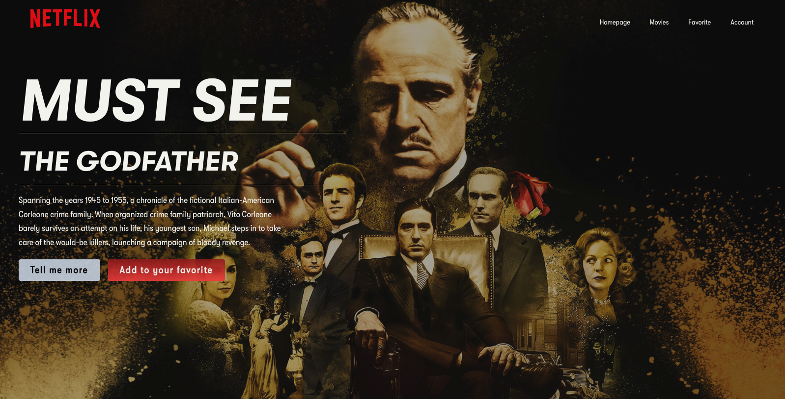
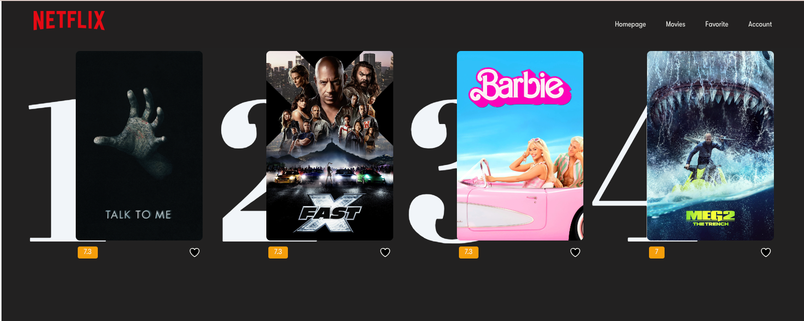
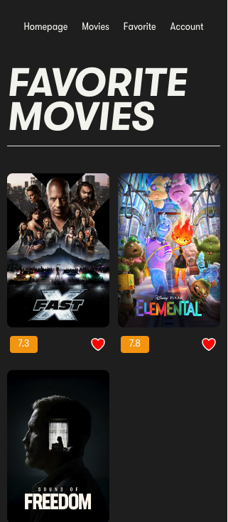

# Netflix-clone 🎥

## About this project
I made this project as a test case for a company. The goal was to develop a Netflix-like app using the TMDB API. 
While TMDB API is generally well documented, the auth control documentation was quite challenging 😅 These ressources helped me a lot : v4 list(<http://dev.travisbell.com/play/v4_list.html>), V4 Authentication (<http://dev.travisbell.com/play/v4_auth.html>).
 Since it was my first time using Vue3 and Tailwind, I made some documentation : you can access it here(<https://www.notion.so/maiab/Vue-3-Pinia-838163f9d53d4b448f7558aa0bd3e405?pvs=4>).

## Technologies
- Vue 3
- Tailwind
- Typescript
- API : TMDB

## Example
- **Live example:** currently on deployment
- **Screenshots**

